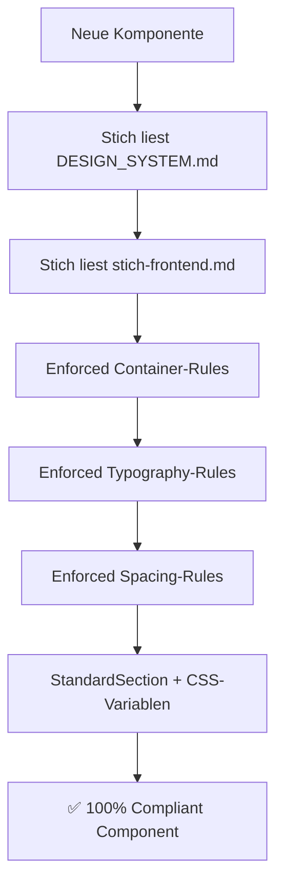

# 🎯 DESIGN-SYSTEM ARCHITEKTUR — "Für alle Ewigkeiten"

> **Mission:** "Aus einem Guss für alle Ewigkeiten" — Unumstößliche Design-Standards für das Jassverband-Schweiz Ecosystem.

---

## 📋 HYBRID-STRUKTUR ÜBERSICHT

### **Zwei-Datei-System für maximale Effizienz:**

| Datei | Zweck | Zielgruppe | Aktualisierung |
|-------|-------|------------|----------------|
| **[`DESIGN_SYSTEM.md`](./DESIGN_SYSTEM.md)** | 🏛️ **Universelle Design-Bibel** | Alle (Dev, Design, Stakeholder) | Bei Design-Änderungen |
| **[`.cursor/agents/stich-frontend.md`](.cursor/agents/stich-frontend.md)** | 🤖 **Agent-Execution-Layer** | Stich-Agent + Entwickler | Bei Code-Patterns |

---

## 🏛️ DESIGN_SYSTEM.md — Die Design-Bibel

**Was drin steht:**
- 📐 **Exakte Container-Spezifikationen** (1152px, 768px, 1024px)
- 🎨 **Farbpalette mit CSS-Variablen** (`--color-primary`, etc.)
- ✍️ **Typography-Hierarchie** (Capita/Inter, clamp-Werte)
- 📏 **Spacing-System** (8px-Grid, py-20 md:py-24)
- 📱 **Responsive-Breakpoints** (Mobile < 768px, Desktop ≥ 1024px)
- 🏆 **Goldene Regeln** (NIEMALS zu brechen)

**Warum separat?**
- ✅ **Technologie-agnostisch** — funktioniert auch ohne React
- ✅ **Stakeholder-lesbar** — auch Non-Tech kann verstehen
- ✅ **Git-versioniert** — nachvollziehbare Design-Entscheidungen
- ✅ **PR-reviewbar** — Design-Changes transparent

---

## 🤖 stich-frontend.md — Der Execution-Layer

**Was drin steht:**
- 🔧 **Code-Patterns** für StandardSection, SafeAnimateOnScroll
- ⚡ **Enforcement-Logic** — wie Stich die Regeln durchsetzt
- 🧑‍💻 **Implementierungs-Guidelines** — TypeScript, framer-motion
- ✅ **Compliance-Checkliste** — 100% Design-System-treue

**Warum Agent-integriert?**
- ✅ **Direkter Zugriff** — Stich kann sofort enforced
- ✅ **Code-spezifisch** — React/Next.js Implementation-Details
- ✅ **Auto-Updates** — Agent bleibt synchronized mit Design-System

---

## 🔗 SYNERGIE-EFFEKT

### **Workflow bei neuen Komponenten:**



### **Update-Flow:**

1. **Design-Änderung** → Update `DESIGN_SYSTEM.md`
2. **Code-Pattern-Änderung** → Update `stich-frontend.md`
3. **Beide referenziert** → Stich hat vollständiges Verständnis
4. **Enforcement automatisch** → Neue Komponenten automatisch compliant

---

## 🚀 VORTEILE DIESER ARCHITEKTUR

| Vorteil | Umsetzung |
|---------|-----------|
| **📚 Single Source of Truth** | DESIGN_SYSTEM.md als Master-Referenz |
| **🤖 Agent-Integration** | Stich liest beide Files für vollständige Guidelines |
| **👥 Team-Friendly** | Alle können Design-System verstehen und beitragen |
| **🔄 Wartbarkeit** | Klare Trennung zwischen Design-Rules und Code-Implementation |
| **📈 Skalierbarkeit** | Neue Features automatisch design-system-compliant |
| **🏆 Langlebigkeit** | "Für alle Ewigkeiten" — zukunftssicher strukturiert |

---

## 📋 VERWENDUNG

### **Für Entwickler:**
```bash
# 1. Design-Regeln verstehen
cat DESIGN_SYSTEM.md

# 2. Implementation-Patterns lernen  
cat .cursor/agents/stich-frontend.md

# 3. Neue Komponente mit Stich bauen
"Stich, baue ProfileCard mit StandardSection"
```

### **Für Stich-Agent:**
```typescript
// Stich liest automatisch beide Files:
// 1. DESIGN_SYSTEM.md für Design-Rules
// 2. stich-frontend.md für Code-Implementation

// Resultat: 100% Design-System-compliant Components
```

---

## ✅ ERFOLGSMESSUNG

### **Design-System Health-Score:**
- **Container-Konsistenz:** ✅ Alle Sections nutzen StandardSection
- **Typography-Compliance:** ✅ Capita/Inter korrekt zugewiesen  
- **Color-Purity:** ✅ Nur CSS-Variablen, keine Hex-Codes
- **Spacing-Harmony:** ✅ 8px-Grid durchgängig eingehalten
- **Responsive-Excellence:** ✅ Mobile-First in allen Komponenten

---

## 🔄 VERSION & CHANGELOG

| Version | Datum | Was |
|---------|-------|-----|
| **1.0.0** | 2026-03-02 | Initial Hybrid-Architektur nach Container-Einheitlichkeits-Mission |

---

**🎯 FAZIT:** Diese Hybrid-Struktur ist die optimale Lösung für "alle Ewigkeiten" — robust, wartbar, agent-integriert und team-friendly. Das Design-System ist unumstößlich dokumentiert, während die Implementierung flexibel und zukunftssicher bleibt.

*"Aus einem Guss für alle Ewigkeiten"* ✨